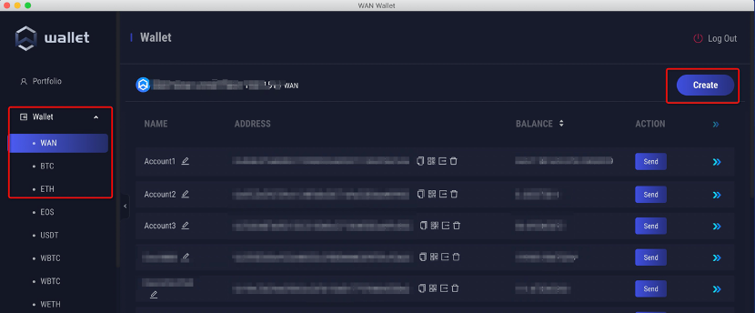
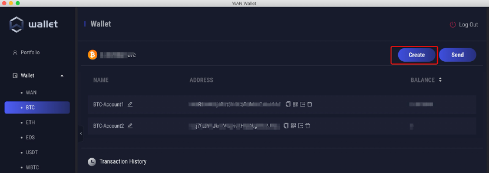
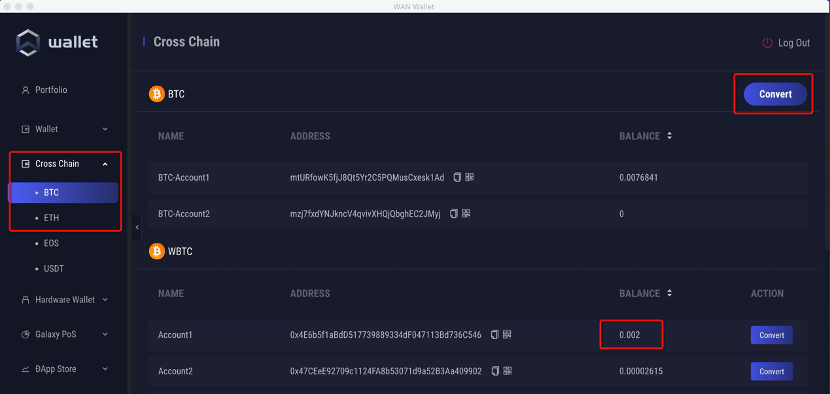
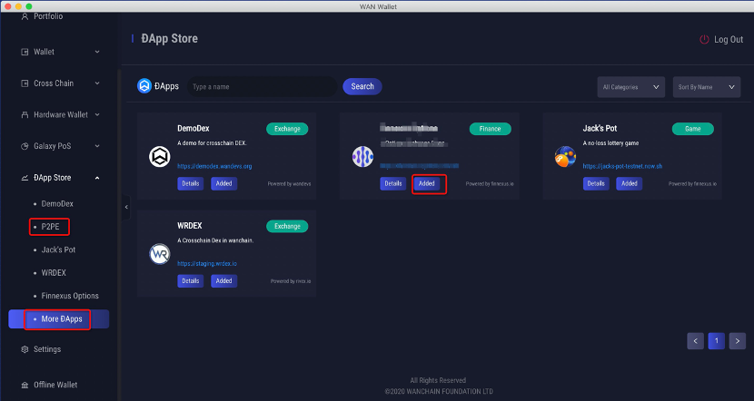
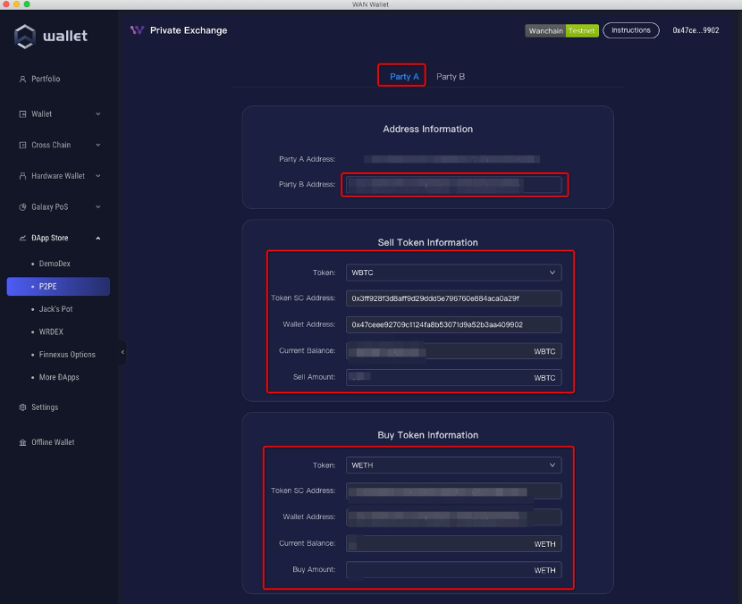
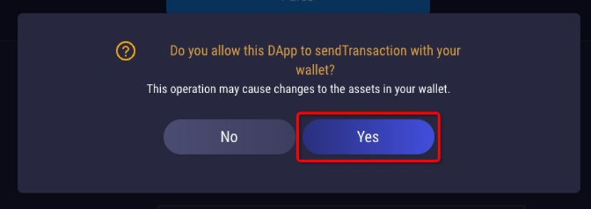

# WanSwap
# User Manual

[[中文版用户手册]](./user-guide_zh-CN.md)

# 1. Overview

WanSwap (peer to peer exchange) is a decentralized trading DApp built on Wanchain which allows for the exchange of value between assets from multiple different blockchains.

**WanSwap Features:**

    1) 0 transaction fee for all orders

    2) Ability determine the exact price and amount of currency for trade execution.

    3) All current WRC20 tokens can be traded supports the adding of new WRC20 tokens.

    4) Dual security guarantee based on both HTLC (Hash Time Locking Contract) and Token Approve.

    5) The order can be cancelled at any time before it is finalized on chain. After the cancellation, the order is no longer available and there is no delay for token withdrawal.

    6) Order transaction information is not visible through the UI, it is only visible through on-chain data.

    7) Doesn’t require sending of tokens to an online wallet of contract address prior to transaction. Transactions can be executed directly from user’s wallet (with Ledger hardware wallet support).

    8) Multi-chain and multi-currency transactions can be supported through Wanchain’s cross-chain tech.

# 2. Application Scenario

Lucy wants to buy 1,000 ETH at a unit price of 0.0248 BTC, and plans to spend a total of 24.8 BTC. If this operation is completed through an exchange, it could be difficult to complete in a single transaction – resulting in multiple transactions, transactions fees, wasted time, and likely price slippage resulting in losses. Therefore Lucy decides to buy her ETH for a fixed price in an OTC transaction. 

First Lucy posts an ad to her social network: 

"Buying 1,000 ETH at 0.0248 BTC/ETH"

Tom sees Lucy's post and wants to sell his ETH her, so after the two communicate and agree on the details, they decide to move forward with the transactions. 

If Tom and Lucy were to proceed using a trusted third party mediator such as a law firm it would be costly and complex. After research different methods for completing OTC transactions without a trusted third party mediator, the pair decide that WanSwap is the best solution. The pair move forward with the transaction as follows:

# 3. Operation Process

**Step 1:** Lucy and Tom each download the Wanchain desktop Wallet from the Wanchain homepage. 

Download: [https://wanchain.org/getstarted](https://wanchain.org/getstarted)

**Step 2:** Lucy and Tom create WAN address, ETH address and BTC address in the light wallet.

**Step 3:** Lucy and Tom each transfer 1 WAN to their WAN addresses to pay for transaction fees 

**Step 4:** Lucy deposits his BTC to his Bitcoin address (including a small amount for transaction fees), and Tom deposits his ETH to the Ethereum address of his wanchain wallet (including a small amount for fees);

**Step 5:** Lucy and Tom each complete the cross-chain swap in the Cross Chain section of the wallet in order to convert their BTC and ETH to WBTC and WETH respectively. Both Lucy and Tom each make sure that the address where their WAN fee is stored is where they hold their WBTC and WETH WRC20 tokens.

**Step 6:** Lucy and Tom open the DApp store section of the Wallet and add the WanSwap DApp to their wallet’s local DApps section.

**Step 7:** Lucy and Tom open the WanSwap DApp in the wallet, and select the addresses where WBTC and WETH are stored through address selector in the top right corner.

**Step 8:** Tom, as Party B, sends his WETH address to Lucy through his messaging app.

**Step 9:** Lucy will input the address received from Tom on the Party A page in the Party B Address input field, and fill in the Buy and Sell information carefully (selling 24.8 WBTC and buying 1,000 WETH). She will also check the Token information, including the checking that the Token Smart Contract address and the balance of the address are correct.  

**Step 10:** After Lucy’s information is filled in and checked and she has selected an appropriate order timeout time, Tom must complete the subsequent steps within the timeout period, otherwise the transaction order is automatically invalid. After inputting and checking all required information Lucy clicks the Approve authorization switch below to allow the smart contract to transact with the 24.8 WBTC in Lucy’s wallet.

**Step 11:** After Lucy completes the Approve operation, she clicks the Sign Order button below, which will generate hashed and signed order data in the field below. She will then click the Copy Data button to copy the order data and send it to Tom through a messaging app. 

**Step 12:** After receiving Lucy's order data, Tom pastes it into the Paste area at the top of the Party B page and clicks the Parse button.

**Step 13:** Tom can see the detailed order information after clicking Parse. Tom carefully checks the amount of WETH sold and the amount of WBTC bought, carefully checks the Token contract address and account balance, and checks the order expiration time. After verifying all the information, he clicks the Approve button to grant the smart contract the right to usethe 1,000 WETH in his account.

**Step 14:** After the Approve operation succeeds, Tom clicks the Send to Exchange button to send the order to the smart contract for settlement. The smart contract verifies the validity of the information, balance, and signature of both parties. If everything is valid, the token exchange is completed.

**Step 15:** Lucy and Tom completed the exchange of WBTC and WETH through the above steps, and can return to the wallet Cross Chain page where they can convert back to BTC and ETH respectively. At this point, the entire transaction process is complete.

# 4. Remarks

For detailed security analysis and working principle see: 

[WanSwap Working Principles](./P2P_Exchange_Working_Principles.md)

# 5. Q&A

**Question 1: What are the advantages of WanSwap over ordinary HTLC trading products on Ethereum?**

Answer: 

WanSwap has the following four advantages over ordinary HTLC trading products on Ethereum:

1) By taking advantage Wanchain’s cross-chain features, WanSwap can power multi-currency and multi-chain trading without the need to trust any third party mediator.
 
2) There is no need to deposit tokens in a smart contract prior to the transaction, which improves security and increases user control.

3) Both parties to the transaction use the same smart contract transaction, and the contract code is open and transparent.

4) The transaction initiator Party A can cancel the transaction at any time before Party B completes the transaction without any delay

**Question 2: Why should WanSwap users manually click on the approve switch to perform asset authorization operations on smart contracts instead of completing them automatically in the background?**

Answer: 

Because the authorization switch is a safety guarantee for the user's transaction, the user can cancel the transaction by manually turning off the authorization switch at any time to protect the asset from loss. On the other hand, because the Approve operation gives a high level of control over user assets to the smart contract, the user should perform the operation deliberately and with full understanding.

**Question 3: Is there no fee for WanSwap transactions?**

Answer: 

When using WanSwap for WRC20 token transactions, there is no fee at all, but if users need to perform a cross-chain transaction first and then trade, they need to pay a small amount of cross-chain fees.

**Question 4: Are WanSwap products completely open source? Can WanSwap be ported to Ethereum to work?**

Answer: 

The smart contract code and front-end code are completely open source and can be ported to Ethereum to work, but after the porting, they will not have cross-chain functions. In the future, after the Wanchain’s bidirectional  cross-chain bridge is complete, cross-chain transactions can also be performed on Ethereum. However, transaction fees are much more expensive than Wanchain, and also much slower.

**Question 5: When should I toggle the “Approve” button on WanSwap, and when can I cancel it?**

Answer: 

As long as the transaction is successfully completed, it can be canceled.

Question 6: What is the relationship between WanSwap and Wandex?

Answer: 

WanSwap is an independent DApp that does not depend on Wandex, but the on-chain settlement part uses Wandex’s smart contracts. This smart contract does not restrict users, any DApp developed by anyone can use it to complete on-chain settlement transactions.

**Question 7: For the WanSwap "Approve" operation, if I Approve, but do not cancel the Approve operation, will it automatically cancel the Approve operation at some time?**

Answer:

No, it will not automatically cancel. It works like the wandex. but wandex approve a big amount, WanSwap only approve the amount you want to trade.
If you trade 10 WWAN, it approve only 10WWAN, it turns to zero when you trade finish.
